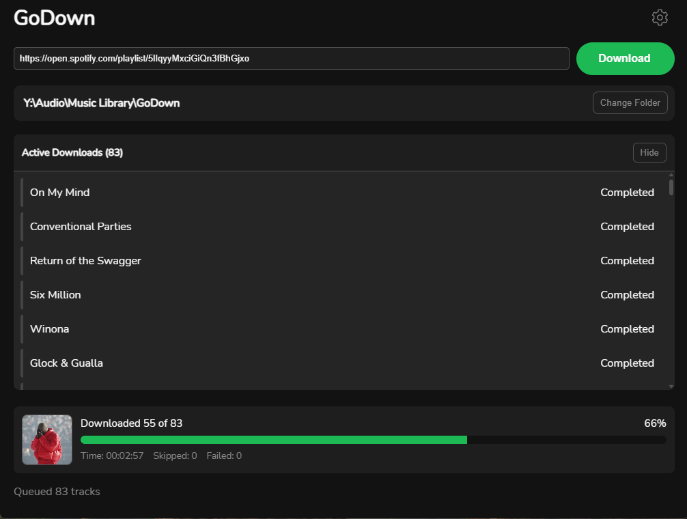

# GoDown

Pretty much a spotify and yt-dlp wrapper

## Sample

## Config

| Name | Description | Default |
| ------- | ------- | ------- |
| `download_path` | Absolute path to where the files will be downloaded | asdsad |
| `workers` | How many downloads will happen simultaneously | 3 (*Recommended: 3, Max: 5*) |
| `retries` | Amount of retries with new query and length mismatch error | 3 |
| `debug_mode` | Prints yt-dlp output to console | false |

## Future features

- [x] Thumbnail embeding
- [x] Metadata embeding
- [ ] BPM embeding
- [ ] Download Progress bar
- [ ] Other platforms

## Current limitaions

- Spotify limited to 100 songs per playlist
- Can't download indiviudal songs
